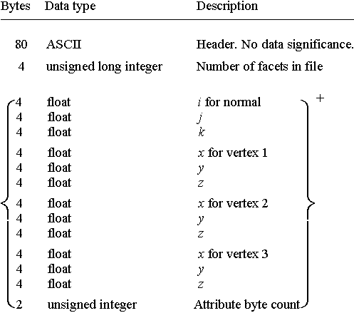

# Part 0: STL info and the basic code structure

[Repository commit link](https://github.com/RobbeDGreef/aswj/tree/f9a6fe31a69c703914096a52da9e43b02d6a6707)

## Stl file format (theory)
The first thing I did was look up a stl documentation spec. Since that is the file format I am going
for. I immediately found the stl [wikipedia page](https://en.wikipedia.org/wiki/STL_(file_format)) which gave some insight into the stl format.
There are three things I immediately noticed:

- There are two types of stl formats (ascii and binary).
- Stl files contain no scale information
- The file just exists of a tom of triangles and a header, nothing else.

The latter was something I already suspected but now I was certain. The [fabbers site](http://www.fabbers.com/tech/STL_Format)
had the best information about the exact format in my opinion. Since I quickly realized ascii
stl is barely used I chose to go for binary stl. Not that that was much of a choice since
blender generated binary stl files and I was nog going to try and find a way to convert them.

Now that I knew the stl format I needed to create some stl files to load. So I just opened up blender
and exported some [simple figures](/tests/stls). For now a simple box, cube, suzanne and this weird
curved thing I made
would suffice.

And for the coders here this is the stl file format in the *lingua franca* of programming, C.

    struct stl_file
    {
        uint8_t     header[80];     // Just an ascii header, has no real meaning.
        uint32_t    facet_count;    // The amount of facets in the file (triangle count)

        // The facet structure:
        // (this will exist exactly as much times as facet_count in the file)
        struct facet {
            float   normal_i;       // The i (x) aspect of the normal
            float   normal_j;       // The j (y) aspect of the normal
            float   normal_k;       // The k (z) aspect of the normal

            float   vertex1_x;      // The first vertex x component
            float   vertex1_y;      // The first vertex y component
            float   vertex1_z;      // The first vertex z component

            // The rest is pretty self explanatory

            float   vertex2_x;
            float   vertex2_y;
            float   vertex2_z;

            float   vertex3_x;
            float   vertex3_y;
            float   vertex3_z;      
        }; 
    }__attribute__((packed));

## The basic code structure
Currently I created the following folders and files

include/
    stlparser/
        stlparser.h
    
    core.h
    debug.h
src/
    generator/
    stlparser/
        stlparser.cpp
    
    main.cpp
tests/
    stls/
        box.stl
        cube.stl
        suzanne.stl
        curved.stl
        
CMakeLists.txt
build.sh

main.cpp is a simple main file like you would expect:

    #include <stlparser/stlparser.h>

    int main(int argc, char const *argv[])
    {
        if (argc < 2)
        {
            ERROR("No input files", 1);
        }
    
        StlParser(std::string(argv[1]));
    }

StlParser.cpp and StlParser.h respectivly:

    #include <stlparser/stlparser.h>

    StlParser::StlParser(std::string file)
    {
        m_stlfile.open(file, std::ios::binary);
        LOG("Opened file " << file);
    }

    StlParser::~StlParser()
    {
        m_stlfile.close();
    }

    // StlParser.h
    #pragma once

    #include <core.h>

    class StlParser
    {
    private:
        std::ifstream m_stlfile;
    public:
        StlParser(std::string file);
        ~StlParser();
    };

`core.h` is just a file that holds a lot of general headers that are used throughout the project.
`debug.h` will hold debugging macros and functions. For now I implemented some basic printing
functions.

build.sh is a simple script to run cmake and move the binary.
CMakeLists.txt is a general cmake file.

Note that I won't always show the hole files like I did here. You can always just
check the repository commit time to see what the files looked like. I will always provide an easy
link for you at the top of the partX.md file.