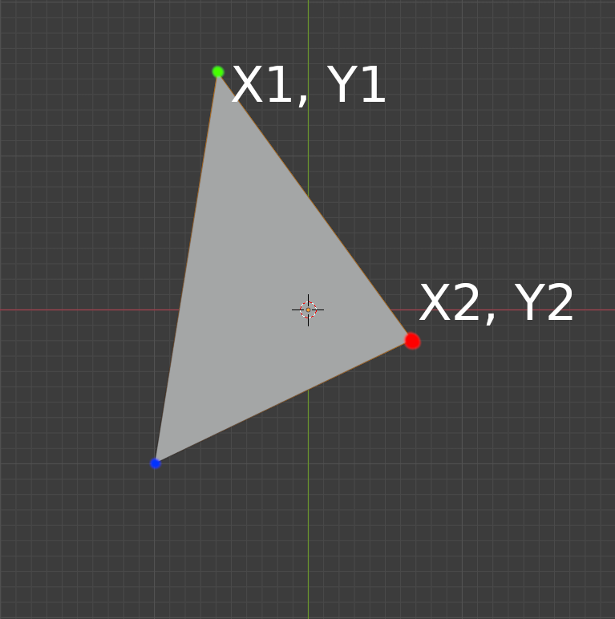
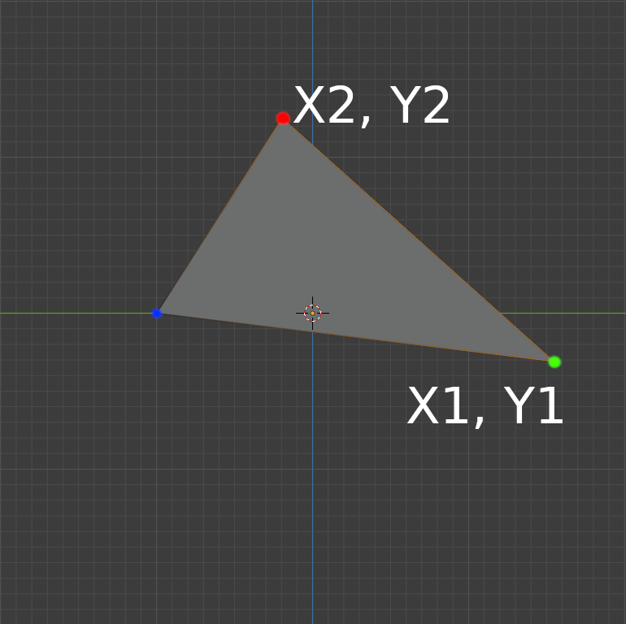
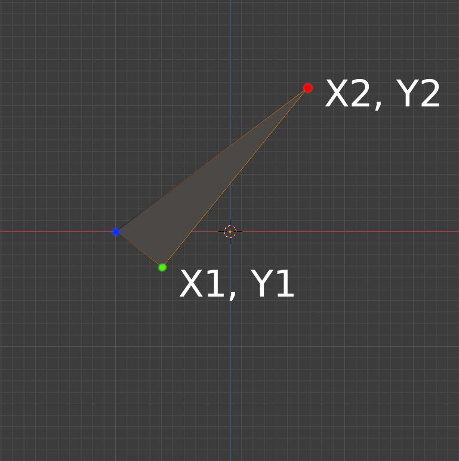

# Part 2: Actual slicing

[Repository commit link](https://github.com/RobbeDGreef/aswj/tree/455d3e5eea14840338ceca365f5586af148d4d72)

In this part we will do some actual first slicing, exciting :)

## Theory
### Math
But first, some theory. Slicing algorithms require some basic math. Just some regular algebra will
suffice. 

We need a way to calculate the point on a line at a certain z value (3d dimensional, z is up
in this case). 
Since this is 3d, some people find it hard to visualize. Thats why I created a file called
`facet.blend` in the tests/ folder. It holds a simple triangle shaped plane in blender but
it gives an idea. To facet from different angles use the 1 3 7 keys on your numpad, and the 5 key
to go in orthogonal mode.

But to make it easier for you I added some screenshots for you here
<p float="left">
    
    
    
</p>

The first is the top view, the second is the view from the left and the last the view from the right.
I also marked the points so that you know which is which.

Now for the math.

The problem: Find the correct x and y values of a point on a line in 3d space, given the z value of said point.

We can view this problem as 2 2d problems, and that is exactly what I did. We will need the 

y = m*(x - x<sub>1</sub>) + y<sub>1</sub>

formula. Where m is the slope that you can calculate with:

m = (y<sub>2</sub> - y<sub>1</sub>) / (x<sub>2</sub> - x<sub>1</sub>)

Easy highschool stuff.

#### Finding the X location of the point
Now lets take a look at the last image.


And try to calculate the correct x value for the point. The Z slicing height is given, because
we know what height we are slicing at. The problem is finding the X location. For that we will
have to modify our formula a bit, so lets extract x out of it:
(As you can see on the image the z values (blue axis) are in 2d math mostly referred to as the y
axis so, the formula above uses y as a variable too. We have to change the y's of the formula
into z's but that does not change anything about the formula itself, it is just a variable
name)

x = (z - z<sub>1</sub>) / ( (z<sub>2</sub> - z<sub>1</sub>) / (x<sub>2</sub> - x<sub>1</sub>) ) + x<sub>1</sub>

(Here our 'z' (without a number) is the z height that was given.)

#### Finding the Y location of the point
Now if we do the same thing for the y values we should be good.


y = (z - z<sub>1</sub>) / ( (z<sub>2</sub> - z<sub>1</sub>) / (y<sub>2</sub> - y<sub>1</sub>) ) + y<sub>1</sub>

All of this math is only valid for when the line is not straight up (x1 == x2 & y1 == y2). When
this is the case, the m would give you a 0 / 0 which we don't really like. Of course the point
is easily defined then. It is simply the x value of the points, y value of the points and the z height.

Just remember when implementing this that you need to check that this is not the case.

And yayyy, that was all the math.

### The algorithm
Now that we can calculate the intersection points of our z slicing plane. We have to think about
what to do next. Well, we have to make lines from these points right? Well luckily this is 
pretty easy. We are using triangles, meaning we don't have to worry about how to lay out the line
connections like we would with a polygon (there are no diagonals in triangles).

So the first step is to loop over the facets that are within the current z height range.
I updated the facet loading system to calculate the minimum and maximum z location of the facet
so that we can quickly discard facets but more on that later. The important part now is that
we have to loop over the facets, calculate the intersection points and per facet calculate 
the intersection line.

*What do you mean line? We can have multiple lines per facet right? What if the facet is parallel with the z plane? What if we have only one intersection point?*

Well we do what we computer scientist do best, we ignore those cases. Now I hear you thinking how
does that give us correct slicing results? Well it is actually quite simple, if we have 3 
intersecting points, it means the plane is parallel with the z plane. However in a solid body every triangle
has neighboring triangles, meaning their edges are overlapping, meaning for every parallel facet
there has to be a non parallel facet that shares that edge, so we can just ignore the parallel facet
and focus on the non parallel one. The other case is just one intersecting point. This only happens
when the facet only shares a single point with the z slicing plane. If this happens, how do you want
to make a line with no length? You don't, you just ignore it. We aren't going to be printing individual 
points anyway.

# The code

Since the algorithm is already covered in detail before, im just going to briefly show the 
relevant code parts.

(I renamed vec3f.h to primitives.h because that name is more fitting now, I also
renamed struct vec3f itself to Vec3f (class) to be more c++ish and consistent)

I implemented a Line class that just holds two points
```cpp
class Line
{
public:
    struct vec3f p1;
    struct vec3f p2;

    float m_min_z;
    float m_max_z;

public:
    Line() {}
    Line(vec3f p1, vec3f p2);

    std::string to_string() { return "(" + p1.to_string() + ") (" + p2.to_string() + ")"; }

    bool contains_height(float height);
    vec3f calc_point_from_z(float z);
};
```

The Line class gets two important functions: `contains_height` and `calc_point_from_z`.
The first one is a predicate that return true if the height is larger or equal to the 
smallest z height of the line points and smaller or equal to the largest z height of the line points.
However it will also return false if the line is exactly at the z plane (p1.z == p2.z == height).
This is again because the facet will have other lines whose points will be recorded instead.

```cpp
bool Line::contains_height(float height)
{
    if (p1.z == height && p2.z == height)
        return false;

    return height >= m_min_z && height <= m_max_z;
}

Vec3f Line::calc_point_from_z(float z)
{
    // A little math never hurt anyone

    // The z value of the point will be equal to the height 
    // we are slicing at.
    Vec3f res;
    res.z = z;

    // Formula y = m(x - x1) + y1 adapted
    // to x = (y-y1) / m + x1
    // 
    // for x1 != x2 because then we get an infinite m. If x1 is actually
    // equal to x2 we just set the x to that value.
    if (p1.x == p2.x)
        res.x = p1.x;
    else
        res.x = (z - p1.z) / ((p2.z - p1.z) / (p2.x - p1.x)) + p1.x;

    // Same goes for y, instead of x we just use y
    if (p1.y == p2.y)
        res.y = p1.y;

    else
        res.y = (z - p1.z) / ((p2.z - p1.z) / (p2.y - p1.y)) + p1.y;

    return res;
}
```
And now the grand supreme function:
(don't be scared about the size, its more comment than code)
```cpp
void StlParser::slice()
{
    // This algorithm is O(n*m) where is n is the amount of facets
    // and m the height of the object divided by the layer height. 
    // Thats bad. However we will focus on a better solution later.

    // We create a vector of lists of lines to hold the layer data.
    // For the amount of layers we choose a vector because we already know
    // how large this array will be and random access is nice. We don't know
    // how many lines it will hold though and using a vector here would
    // be very inefficient.
    //
    // The amount of layers is equal to the height of the object divided by the
    // layer height rounded up. (+1 because we use <= in the loop instead of <
    // and don't want any segfaults)
    std::vector<std::list<Line>> layers(ceil((m_max_z - m_min_z) / m_layer_height)+1);

    int i_layer = 0;
    for (float height = m_min_z; height <= m_max_z; height += m_layer_height)
    {
        for (Facet facet : m_facet_array)
        {
            // If the height is in range of the facets min and max height
            // try and find the intersection points.
            if (facet.min_z <= height && facet.max_z >= height)
            {
                // The three lines every triangle consists of
                Line lines[3] = {
                    Line(facet.vertices[0], facet.vertices[1]),
                    Line(facet.vertices[1], facet.vertices[2]),
                    Line(facet.vertices[2], facet.vertices[0]),
                };

                // We keep track of the intersecting points in this vector
                std::vector<Vec3f> intersections;
                for (int i = 0; i < 3; i++)
                {
                    if (lines[i].contains_height(height))
                    {
                        intersections.push_back(lines[i].calc_point_from_z(height));
                    }
                }

                // If only one point intersects the z plane, we ignore it
                // because this means we cannot create a line. And printing
                // a single point is useless.
                //
                // We don't handle any cases where all 3 points intersect because
                // we already check if this is the case in Line::contains_height()
                // and if so, discard the case as false.
                // meaning we can never reach the point where 3 vertices intersect.

                // We ignore lines that have the same start and end points because those are
                // just points and we don't want those in the sliced data.
                if (intersections.size() == 2 && intersections[0] != intersections[1])
                    m_layers[i_layer].push_back(Line(intersections[0], intersections[1]));
            }
        }
        i_layer++;
    }

    // Now lets print out layers to inspect the output   
    for (int i = 0; i < layers.size(); i++)
    {
        LOG("Layer: " << i);
        for (Line line : layers[i])
        {
            LOG("intersection line: " << line.to_string());
        }
    }

    // Because this data is not very visible i wrote a script to dump this to
    // files and display the data using python.
    debug_layers_to_file(layers);
}
```
Now in the main file after the `parser.parse()` just call `parser.slice()`.

Now that I saw the slice data printed, I wanted to visualize the code to do so I wrote a small
script that extracts the layers to simple txt files and then wrote a small python application
to show the data. Im not posting the code here because it is not necessary but take a look
its cool :)