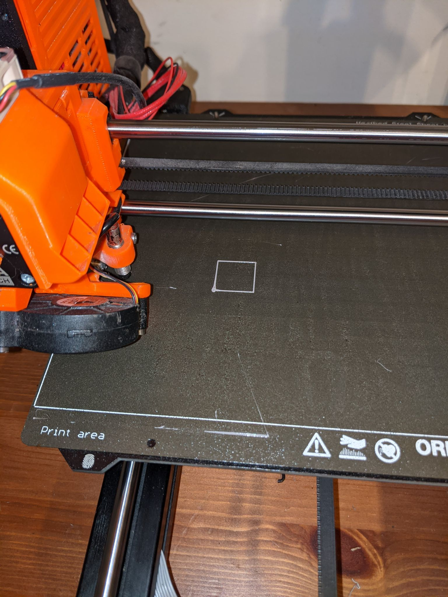
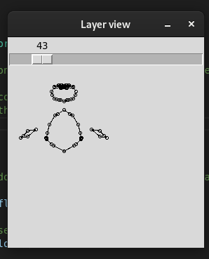

# Part 3: Generating some simple gcode

[Repository commit link](https://github.com/RobbeDGreef/aswj/tree/8bada1eaf2f49277e3cd2382f66fc9dfbbdc8727)

A lot of code for a small print, but at least we made it ourselves:

(The first layer of the box.stl without infill)

It's not much but it's a start :)

## Theory
I did not cover any actual code generation in the theory here because there is not really any
theory to that. But if you are interested you can always look at the code below.

### What should the gcode look like
I started this part wanting to generate some basic gcode. No infil yet, just
the outline. Luckily for us gcode is a very very simple language. I just generated
some gcode with prusa slicer, took the [reprap gcode documentation](https://reprap.org/wiki/G-code) with me and got to work.

First I started looking at the start and ending sequences of the gcode.
For a general printer PrusaSlicer generated something like this:

    M107 ; Turn fan off
    M104 S200 ; set temperature
    G28 ; home all axes
    G1 Z5 F5000 ; lift nozzle
    M109 S200 ; set temperature and wait for it to be reached
    G21 ; set units to millimeters
    G90 ; use absolute coordinates
    M82 ; use absolute distances for extrusion
    G92 E0 ; set position

Some of the codes were even already documented! The rest I filled in using the 
reprap documentation. This seemed easy enough. The rest of the code was
something like this:

    ; Filament gcode (the part before the actual move commands)
    G1 Z0.350 F7800.000             ; Move the z height up to 0.350 mm
    G1 E-2.00000 F2400.00000        ; Move the extruder -2 mm, e.i. retract 2 mm
    G92 E0                          ; Interpret current extruder position as 0
    G1 X90.147 Y90.491 F7800.000    ; Move to the start location on the bed
    G1 E2.00000 F2400.00000         ; Extrude 2 mm (since we just retracted 2 mm this will cancel out)

    ; Some of the actual move and printing commands
    G1 F1800.000                    ; Set the motor speed to 1800mm/min
    G1 X91.174 Y89.592 E2.12409     ; Move to x: 91.172 y: 89.592 and extrude 0.12409 
                                    ; mm of filament
                                    ; Its important to see here that the E values are
                                    ; absolute.

    G1 X92.363 Y88.923 E2.24819     ; So only 2.24819 - 2.12409 = 0.12410 mm is 
                                    ; extruded here.

    G1 X93.670 Y88.510 E2.37286     ; You get the idea
    ; ...

Now remember this is just for a 'general' printer, I did not yet select the prusa mk3s
as my printer.

The code that really stands out here certainly is `G1`, it moves the printer head.
It can take up to 5 arguments an X, Y and Z value, an E value, which is used for the
extrusion motor and at last an F value that specifies the motor speed in mm/min.
(Only mm because it was selected using `G21` in the begin code). It is important 
to realise that the printer remember the G1 command parameters you pass it. For example
if you send a `G1 F3000` command and don't specify any F values in your next `G1`
commands, the 3000 mm/min speed will still be used.

Now this was all good, but since this was a generic printer I selected the mk3s as
printer and looked at the gcode again.

    M73 P0 R4 ; display percent done
    M73 Q0 S4
    M201 X1000 Y1000 Z1000 E5000 ; sets maximum accelerations, mm/sec^2
    M203 X200 Y200 Z12 E120 ; sets maximum feedrates, mm/sec
    M204 P1250 R1250 T1250 ; sets acceleration (P, T) and retract acceleration (R), mm/ sec^2
    M205 X8.00 Y8.00 Z0.40 E4.50 ; sets the jerk limits, mm/sec
    M205 S0 T0 ; sets the minimum extruding and travel feed rate, mm/sec
    M107 ; turn off the printing fan
    M862.3 P "MK3S" ; printer model check
    M862.1 P0.4 ; nozzle diameter check
    M115 U3.8.1 ; tell printer latest fw version
    G90 ; use absolute coordinates
    M83 ; extruder relative mode
    M104 S240 ; set extruder temp
    M140 S85 ; set bed temp
    M190 S85 ; wait for bed temp
    M109 S240 ; wait for extruder temp
    G28 W ; home all without mesh bed level
    G80 ; mesh bed leveling
    G1 Y-3.0 F1000.0 ; go outside print area
    G92 E0.0
    G1 X60.0 E9.0 F1000.0 ; intro line
    M73 Q1 S4
    M73 P1 R4
    G1 X100.0 E12.5 F1000.0 ; intro line
    G92 E0.0
    M221 S95
    G21 ; set units to millimeters
    G90 ; use absolute coordinates
    M83 ; use relative distances for extrusion
    M900 K45 ; Filament gcode
    ;BEFORE_LAYER_CHANGE
    G92 E0.0
    ;0.2

Well damn, thats a little more boilerplate code. Most of this can be ignored though.
Every `M73` is just to specify the progress through the file. On top of that most of
the tests, and maximum acceleration etc is not necessary.

Now the ending codes are pretty simple. We just
turn off the fan, temperature, motors and home the x axis.

    G92 E0  ; interpret extrusion as 0
    M107    ; turn off the fan
    M104 S0 ; turn off temperature
    G28 X0  ; home X axis
    M84     ; disable motors

### The algorithm
Now that we got that cleared up, the next challenge is calculating the way the head moves. It has to 
go from point
to point and we currently we only have a list of lines generated by the slice function. So let's 
create 
what I called a 'flow' here. Every layer can hold multiple flows. Think about it.
Every layer can have multiple closed polygons. for example here in this sliced
suzanne. Every polygon will be a separate flow.

So we need an algorithm to calculate these flows. So I implemented something
basic.

We represent flows just as a list of points. These points will just be the locations
that the printer head has to go to. 

Since we are working with solid objects, every slicing will yield a bunch of lines
that together make some enclosed polygons like what is visible on the image above.
This also means that every point of every line has to merge with a point of a different
line. When the point merges with a point that is already in our flow the object is means the
flow is closed and
we can add start a new flow object. Every time that we add a point of a line to the flow
we remove the line from the list of lines so that we don't merge with any of these points again.

So we basically just want to loop over the lines, find the line that has a point in common
with the last point in our flow object and if it does, add the other point of the line to the flow.

Some pseudo code:
(checking the actual code might be clearer)
    all_flows = []
    flow = []
    flow.add_last(lines.first.p1)
    flow.add_last(lines.first.p2)
    lines.remove(lines.first)

    while lines is not empty:
        to_search = flow.last_element

        for line in lines:
            if line.p1 == to_search:
                flows.add_last(line.p2)
                lines.remove(line)
                break

            else if line.p2 == to_search:
                flows.add_last(line.p1)
                lines.remove(line)
                break
        
        if flow.last_element == to_search:
            all_flows.add_last(flow)
            flow.clear()

            flows.add_last(line.p1)
            flows.add_last(line.p2)

Now that we have a general idea we can get to the code.

## The code

I started by writing a simple generator class

    class Generator
    {
    private:
        std::vector<Code> m_codes;
        int m_temp;
        int m_bed_temp;
        float m_layer_height;
        
    public:
        Generator(int temperature, int bed_temp, float layer_height);
        void generate(std::vector<std::list<Line>> layers);
        void write_to_file(std::string file);
    };

Now I wanted to represent the gcodes in memory as another class:

    class Parameter
    {
    private:
        char m_letter;
        bool m_is_float;
        union
        {
            float m_fvalue;
            int m_ivalue;
        };

    public:
        Parameter(char letter, float val);
        Parameter(char letter, int val);

        std::string to_string();
    };

    typedef std::vector<Parameter> Code;
    std::string code_to_string(Code);

The `Code` class is just a typedef because inheriting a stl class is not a great
idea most of the time.

Since most of the gcode files will be very large, the generator constructor
already reserves 500 codes, just to have a slight speed up.

    Generator::Generator(int temp, int bed_temp, float layer_height)
    {
        // Reserver at least 500 lines for performance
        m_codes.reserve(500);
        m_temp = temp;
        m_bed_temp = bed_temp;
        m_layer_height = layer_height;
    }

Writing to file is also pretty straight forward.

    void Generator::write_to_file(std::string file)
    {
        std::ofstream out;
        out.open(file);

        if (!out.is_open())
            ERROR("Could not open file '" << file << "'", 1);

        for (Code code : m_codes)
        {
            out << code_to_string(code) << "\n";
        }

        out.close();
    }

Now that we got that cleared up, we want to implement the `generate()` function.
I split the gcode generation up into seperate functions, this way I can easily 
change settings per layer. 

So now we need the algorithm to calculate the flows. So I implemented something
basic in the `calc_flows()` function.

This is what the `generate()` function looks like right now:

    void Generator::generate(std::vector<std::list<Line>> layers)
    {
        // For now we will just focus on generating the gcode for one layer.

        // If there were any previous codes in the array clear them
        // (for example if we reslice the object after moving it etc.)
        m_codes.clear();

        gen_begin_of_gcode();

        // The first thing we want to do is calculate the adjacent lines and 
        // create a flow of nodes.
        std::vector<std::list<Vec3f>> flows = calc_flows(layers[0]);

        // The first layer has custom settings for better adhesion.
        gen_layer_gcode(1800, 0.091, flows);

        gen_end_of_gcode();
    }

To calculate the flows we do the following. We simply store a vector of flows. Every
flow is represented as a list of `Vec3f`s. These represent the points that the printer
head has to go to.

    std::vector<std::list<Vec3f>> Generator::calc_flows(std::list<Line> lines)
    {
        if (lines.size() == 0)
            return {};

        // A flow can never be empty.
        std::vector<std::list<Vec3f>> flows(1, std::list<Vec3f>{lines.front().p1, lines.front().p2} );
        lines.pop_front();
        int i_flow = 0;

        while (lines.size() != 0)
        {
            Vec3f &p = flows[i_flow].back();

            for (auto i_line = lines.begin(); i_line != lines.end(); ++i_line)
            {
                Line line = *i_line;
                if (line.p1 == p || line.p2 == p)
                {
                    Vec3f &to_push = (line.p1 == p) ? line.p2 : line.p1;
                    flows[i_flow].push_back(to_push);
                    lines.erase(i_line);
                    break;
                }
            }

            // If we did not find an adjacent line
            if (flows[i_flow].back() == p)
            {
                i_flow++;
                flows.push_back(std::list<Vec3f>{lines.front().p1, lines.front().p2});
            }
        }

        return flows;
    }

For this I also had to implement the == operator in the vec3f class.
However if you have ever worked with floating point value you know that
testing the with the regular == operator is a bad idea. We want some kind of tolerance
on our tests. To do this I implemented a simple `test_float()` function that takes two
float values and a epsilon (precision) value.
(I also Implemented the != operator because it will come in handy later)

    #define COMP_PRECISION 0.0001f

    bool operator==(const Vec3f other)
    {
        return test_float(x, other.x, COMP_PRECISION) && test_float(y, other.y, COMP_PRECISION) 
            && test_float(z, other.z, COMP_PRECISION);
    }
    bool operator!=(const Vec3f other)
    {
        // TODO: tolerance
        return !test_float(x, other.x, COMP_PRECISION) || !test_float(y, other.y COMP_PRECISION)
            || !test_float(z, other.z, COMP_PRECISION);
    }

    bool test_float(float x, float y, float epsilon)
    {
        return fabs(x - y) < epsilon;
    }

And this seems to work pretty well.

Now its time to take a look at our generation functions.
The first one is `gen_begin_of_gcode()` which generates the preamble gcode.
It is a simple function, again, more comment than code here.

    void Generator::gen_begin_of_gcode()
    {
        // Turn off the fan for the first layer
        m_codes.push_back({Parameter('M', 107)});

        // Set the extruder temperature and do not wait
        m_codes.push_back({Parameter('M', 104), Parameter('S', m_temp)});

        // Set the bed temperature
        m_codes.push_back({Parameter('M', 140), Parameter('S', m_bed_temp)});
a thick;

        // Wait for extruder temperature
        m_codes.push_back({Parameter('M', 109), Parameter('S', m_temp)});

        // Home all axis without mesh bed level
        m_codes.push_back({Parameter('G', 28), Parameter('M', 0)});

        // Mesh bed leveling
        m_codes.push_back({Parameter('G', 80)});

        // Typical prusa intro line: 
        m_codes.push_back({Parameter('G', 92)});
        m_codes.push_back({Parameter('G', 1), Parameter('Y', -3.0f), Parameter('F', 1000)});
        m_codes.push_back({Parameter('G', 1), Parameter('X', 100.0f), Parameter('E', 12.0f),Parameter('F', 1000)});

        // Lift the nozzle
        m_codes.push_back({Parameter('G', 1), Parameter('Z', 5), Parameter('F', 5000)});

        // Set to millimeters, absolute coordinates and absolute distance for extrusion
        m_codes.push_back({Parameter('G', 21)});
        m_codes.push_back({Parameter('G', 90)});
        m_codes.push_back({Parameter('M', 82)});

        // Interpret current extrusion as 0
        m_codes.push_back({Parameter('G', 92), Parameter('E', 0)});
    }

The `gen_end_of_gcode()` is something similar.

    void Generator::gen_end_of_gcode()
    {
        m_codes.push_back({Parameter('G', 92), Parameter('E', 0)});

        // Turn off the fan
        m_codes.push_back({Parameter('M', 107)});

        // Turn off temperature
        m_codes.push_back({Parameter('M', 104), Parameter('S', 0)});

        // Home the x axis
        m_codes.push_back({Parameter('G', 28), Parameter('X', 0)});

        // Disable the motors
        m_codes.push_back({Parameter('M', 84)});
    }

As you can see these just generate the codes that we talked about earlier.

Now for the gen_layer_gcode function. This one is pretty simple as well. We simply use another 
gen function `gen_move_to()` to generate the head moving code (because we have to lift the head
and move it for every flow). We do have to calculate the amount of extruded filament, for now
I just pass the function a extrusion ratio which is equal to the amount of extrusion that should
happen per mm that the head moves. 

    void Generator::gen_layer_gcode(float motor_speed, float extrusion_rat, std::vector<std::list<Vec3f>> flows)
    {
        LOG("Gcode flow size " << flows.size());
        // Between every flow we will lift the head and move to the next starting point
        for (int i = 0; i < flows.size(); i++)
        {
            std::list<Vec3f> flow = flows[i];
            gen_move_to(flow.front(), i);
            m_codes.push_back({Parameter('G', 1), Parameter('F', motor_speed)});

            float extruded = 0;
            Vec3f &previous_p = flow.front();
            for (auto imove = std::next(flow.begin()); imove != flow.end(); ++imove)
            {
                Vec3f &p = *imove;
                float length = sqrtf32( powf32(previous_p.x - p.x, 2) + powf32(previous_p.y - p.y,  2));
                extruded += length * extrusion_rat;
                m_codes.push_back({Parameter('G', 1), Parameter('X', p.x), Parameter('Y', p.y, Parameter('E', extruded)});
                previous_p = p;
            }
        }
    }

    void Generator::gen_move_to(Vec3f p, int layer)
    {
        float height = (layer + 1) * m_layer_height;
        m_codes.push_back({Parameter('G', 92), Parameter('E', 0)});
        m_codes.push_back({Parameter('G', 1), Parameter('Z', height + 1), Parameter('E', -2.0f)});
        m_codes.push_back({Parameter('G', 1), Parameter('X', p.x), Parameter('Y', p.y)});
        m_codes.push_back({Parameter('G', 1), Parameter('Z', height), Parameter('E', 2.0f)});
        m_codes.push_back({Parameter('G', 92), Parameter('E', 0)});
    }

Now I just changed our main file a bit.

    std::string s(argv[1]);
    StlParser parser(s);
    parser.parse();
    
    std::vector<std::list<Line>> &layers = parser.slice();
    debug_layers_to_file(layers);

    Generator generator(240, 95, 0.3);
    generator.generate(layers);
    generator.write_to_file("./test.gcode");

The last thing we need to concern ourselves with is the objects location and scale (rotation
too but thats something for later).
I implemented a `apply_transform()` function that applies a certain
scale and offset to all the vertices of all the facets. On top of that
I ground the object so that the lowest vertex is at z height 0.

    void StlParser::apply_transform()
    {
        m_offset.z = -m_min_z * m_scale.z;
        LOG("min_z: " << m_min_z);
        LOG("offset: " << m_offset.to_string());
        LOG("scale: " << m_scale.to_string());

        for (Facet &facet : m_facet_array)
        {
            for (int i = 0; i < 3; i++)
            {
                facet.vertices[i].transform(m_offset, m_scale);

                if (facet.vertices[i].z > m_object_height)
                    m_object_height = facet.vertices[i].z;
            }
            facet.calc_z_minmax();
        }
        LOG("Object height: " << m_object_height);
    }

I also changed the parse function a bit because we don't need to
keep track of m_max_z anymore.

    // ...
        for (uint i = 0; i < facet_count; i++)
        {
            m_stlfile.read((char*) &(m_facet_array[i]),FACET_STRUCT_SIZE);
            m_facet_array[i].calc_z_minmax();
            
            if (m_facet_array[i].min_z < m_min_z)
                m_min_z = m_facet_array[i].min_z;
        }
    
        apply_transform();
    }

And of course the slice function too.

    // ...
    m_layers = std::vector<std::list<Line>>(ceil(m_object_height / m_layer_height)+1);

    int i_layer = 0;
    for (float height = 0; height <= m_object_height; height += m_layer_height)
    {
        // ...
    

See the `stlparser.h` and layerview.py for the offset and scale changes.

There are some other small changes and functions but you can probably find them 
yourself, and if not, check the repository link at the top of this document.