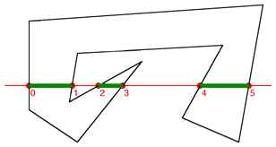

# Part 4: Infill and a first layer

[Repository commit link](github.com/RobbeDGreef/aswj/tree/0c098b9a36732c4c96a56cda42bc75d6bada879d)

In this part we are going to start on some basic infill and a first layer.
I got some pretty good results.

Besides from the line on the outside face the layer quality is really good. This line
is the diagonal of the complete face and this is the spot where the head starts the layer.
I don't know why we get that line there yet but thats something to fix in the next part.

## Infill algorithm (theory)

If you are familiar with polygon fill algorithms, you will easily understand this
too. We will be focusing on a simple rectilinear infill pattern. The top infill will also be for the next part. 

We can break this problem down into a few sub problems:

- How do we define the inside of a layer
- How do we generate an infill pattern
- How do we apply said infill pattern to the inside of the Layer
- How do we handle complicated layer polygon geometry

Well let us answer those in order.

### How do we define the inside of the layer
When you think about a layer we actually think of an enclosed polygon. Since
we are slicing an enclosed object we can assume that every linear plane slice
you take from that object will yield an enclosed polygon. Of course it is possible
that we will have other enclosed polygons in that polygon too but that is not that
important. 
So since we are just dealing with a polygon we can use traditional polygon
algorithms and ideas. One thing you could do is "trace" a line into that polygon
and count the amount of times your trace line crosses a real polygon line. Doing
this you could count the amount of intersections. If the current intersection count
is odd, it means you are in the polygon, if it even, it means you are not.

(note that the image starts counting from 0 and thus odd and even are the other way around)

You can then create lines from those points, and if you do that for regular intervals, 
you can 'fill' the polygon. We however are not interested in coloring in polygons,
we want to generate a pattern. Luckily for us, rectilinear patters are pretty easy this
way.

### How do we generate an infill pattern
We can easily generate a rectilinear pattern by taking 'traces' of the polygon at 
regular intervals on the horizontal axis, and then by doing it on the vertical axis.

Now this goes hand in hand with the next title:

### How do we apply said infill pattern to the inside of the layer
Calculating a 'flow' from these traced lines is not that hard. Since we can be certain
that the lines next to each other won't be obstructed by any geometry (more on that
later) we can create a flow by adding the points of the lines to a 'flow' list 
in reversed order for every odd line. To show what I mean take a look at the path
my code generated for this simple cube.

You might wonder why the infill pattern does not start and end at the outer lines of
the object. This was my first 
approach but I quickly realized that that means you get double the amount of filament
on some layers and that gives bad quality prints. If you look at the output of
professional slicers you will actually notice this too.

### What about complex geometry
See the following image

This explains a possible algorithm for this problem, the algorithm I used is basically
the same except it directly generates flows instead of saving the lines.
Check the code for more details.

However to make this work we first need to do a few small things. First of all
we need to calculate the 'bounding box' of the object. I could explain it but I think
an image speaks a thousand words.

The word bounding box might be a bit misleading since it is more of a bounding
rectangle but whatever. 

So as you can see a bounding box can easily be found by just iterating all you 
vertices and saving the minimum x, minimum y, maximum x and maximum y. 

Now that we have this bounding box, and thus know where we need to start, we can
do our traces. If you want you infill in vertical direction you will need to iterate
the x values of the bounding box and do a trace for all of those x values. The
infill I used will do two traces: one for vertical and one for horizontal traces.

Now to calculate the traces, we will use similar easy math as in the slicing chapter.
We will simply calculate a slope for each line that we want to find a point for,
and use our slightly translated equation. 

where (if we are iterating the y)

x = (y - y1) / ((y2 - y1) / (x2 - x1)) + x1

We do have to check if the y is in range of the ymin and the ymax
 (inclusively).

This algorithm will work for all kinds of weird geometry. Multiple polygons
inside each other, weird edges, etc. It does not generate the most efficient flows
but that is something I don't care about right now. You could build a 
weighted graph and start working out the optimal flow but that will probably defeat
the purpose of writing a simple easy to understand slicer.

## The code
To review your generated gcode, I created a small python script that will show the generated gcode
from the top. This came in handy for me so it might also for you. I used that script to create
the red and blue line infill screenshot above.

I made some small housekeeping changes, for starters, I created a class called 
`Layer` that, you guessed it, will represent a layer. So instead of using 
`std::vector<std::list<Line>>` everywhere, we will now use `std::vector<Layer>`. This
is a little easier to read and is also gives us the opportunity to keep track of 
the bounding box of the layer.

    class Layer
    {
    private:
        std::list<Line> m_lines;

        bool m_bb_set = false;
        float m_min_x = 0, m_min_y = 0, m_max_x = 0, m_max_y = 0;

    private:
        void set_bb(Line &line);

    public:
        float max_x() { return m_max_x; }
        float max_y() { return m_max_y; }
        float min_x() { return m_min_x; }
        float min_y() { return m_min_y; }

        std::list<Line> &lines() { return m_lines; }
        void insert(Line line);

        Layer() {}
        Layer(std::list<Line> lines);
    };

This is pretty basic stuff so I'll let the implementation to you. (again, you can
always use the link on the top of the page if you want to view my solution).

It might be important to know that I implemented this as a sorted `std::list`
because I thought it might come in handy in the future for optimizations,
but I am not entirely sure if it ever will and this is probably not the best idea
because

> Premature optimization is the root of all evil
>
> ~ *Donald Knuth*

I also found a little bug caused by floating point precision. We should always 
account for them because they can give us weird results. So I changed the

    // snip ...
    for (Facet facet : m_facet_array)
        {
            // If the height is in range of the facets min and max height
            // try and find the intersection points.
            if (facet.min_z <= height && facet.max_z >= height)
            {
                // snip ...
    
to

    // snip ...
    for (Facet facet : m_facet_array)
        {
            // If the height is in range of the facets min and max height
            // try and find the intersection points.
            if (facet.min_z <= (height + COMP_PRECISION) && facet.max_z >= (height - COMP_PRECISION))
            {
                // snip ...

I did the same thing in Line::contains_height(), I changed

    if (p1.z == height && p2.z == height)
        return false;

    return height >= m_min_z && height <= m_max_z;

to

    // Notice the test_float() too, that is better as well.
    if (test_float(p1.z, height) && test_float(p2.z, height))
        return false;

    // We have to account for float precision here too
    return height >= (m_min_z - COMP_PRECISION) && height <= (m_max_z + COMP_PRECISION);

The generate function got a loop for the layers, a lastpos variable so that
we don't generate excess move_to()'s (more on that later)

    Vec3f lastpos = Vec3f();

    for (int i_layer = 0; i_layer < layers.size() / 2; ++i_layer)
    {
        // The first thing we want to do is calculate the adjacent lines and
        // create a flow of nodes.
        std::vector<std::list<Vec3f>> flows = calc_flows(layers[i_layer]);

        // The first layer will generate a nice and tight filled layer by using close 
        // intervals, every layer after that will generate a rectilinear pattern where
        // the infill will be alternating between vertical en horizontal.
        if (i_layer == 0)
            calc_infill_flows(flows, layers[i_layer], 0.6);
        else
            calc_infill_flows(flows, layers[i_layer], 4, i_layer % 2);
        

        gen_layer_gcode(1800, 0.07, flows, i_layer, lastpos);

        // Enable the fan on 50% speed after the first layer.
        if (i_layer == 0)
            m_codes.push_back({Parameter('M', 106), Parameter('S', 127)});

        if (flows.size() != 0 && flows.back().size() != 0)
            lastpos = flows.back().back();
    }

I also tweaked the extruder ratio, it was way too high.

`gen_move_to()` got a lastpos parameter:
    
    void Generator::gen_move_to(Vec3f p, int layer, Vec3f lastpos)
    {
        m_codes.push_back({Parameter('G', 92), Parameter('E', 0)});
        float height = (layer + 1) * m_layer_height;

        m_codes.push_back({Parameter('G', 1), Parameter('Z', height + m_retraction_lift), Parameter('E', -m_retraction_length), Parameter('F', m_retraction_speed)});

        // Only generate a go to if the head is not already in the correct location
        // I don't think this makes a huge difference.
        if (!(test_float(p.x, lastpos.x) && test_float(p.y, lastpos.y)))
            m_codes.push_back({Parameter('G', 1), Parameter('X', p.x), Parameter('Y', p.y)});

        m_codes.push_back({Parameter('G', 1), Parameter('Z', height), Parameter('E', m_retraction_length), Parameter('F', m_retraction_speed)});
        m_codes.push_back({Parameter('G', 92), Parameter('E', 0)});
    }

And I forgot to disable the bed temperature after printing so I added this to `gen_end_of_gcode()`

    m_codes.push_back({Parameter('M', 140), Parameter('S', 0)});

Now that we got that out of the way we can get to the part you've been waiting for.
I think the code is very understandable and pretty much everything is explained in the 
comments so I won't do it again here.

This is the function that calculates the infill flows. The most important two parameters
are the interval_size and cross variables here. They define the size of the intervals and 
if you want to generate vertical flows or not.

    void Generator::calc_infill_flows(std::vector<std::list<Vec3f>> &flows, Layer layer, float 
                                      interval_size, bool cross)
    {
        std::vector<std::list<Vec3f>> in_poly_flows;

        int path_amount = -1;
        // We add and subtract the line thickness because we don't want the generated points
        // to be inside the outer perimiter, if this is the case, we would get a lot of excess 
        // filament and bad prints.
        for (float yval = layer.min_y() + m_line_thickness; yval <= layer.max_y() - m_line_thickness;yval += interval_size)
        {
            // Todo: create Vec2f
            std::list<Vec3f> points;

            // The first thing we do is calculate the intersecting points.
            // As you can see the cross variable will yield vertical or horizontal lines
            // by just changing the get_x() function to actually return y etc.
            if (cross)
                calc_infill_points(points, layer, yval,
                                   + -> float& { return x.x; },
                                   + -> float& { return x.y; },
                                   + { return Vec3f(x, y, 0); },
                                   m_line_thickness);
            else
                calc_infill_points(points, layer, yval, 
                                   + -> float& { return x.y; },
                                   + -> float& { return x.x; },
                                   + { return Vec3f(y, x, 0); },
                                   m_line_thickness);

            // The path amount is the amount of intersection lines (points.size() / 2).
            if (path_amount == -1)
            {
                path_amount = points.size() / 2;
                in_poly_flows = std::vector<std::list<Vec3f>>(path_amount, std::list<Vec3f>());
            }
            else if (path_amount != points.size() / 2)
            {
                // If the intersection line amount is different then the path_amount, it means we
                // should save the flows and start new ones
                for (std::list<Vec3f> &flow : in_poly_flows)
                    flows.push_back(flow);

                in_poly_flows.clear();
                path_amount = points.size() / 2;
                in_poly_flows = std::vector<std::list<Vec3f>>(path_amount, std::list<Vec3f>());
            }

            // The point counter is basically an interator (easier then using std::distance())
            int point_counter = 0;
            for (auto i_point = points.begin(); i_point != points.end(); std::advance(i_point, 2))
            {
                // We want one in every two lines to be added in reverse order so that we get
                // a nice rectilinear pattern.
                Vec3f first, last;
                if (in_poly_flows[point_counter / 2].size() % 4)
                {
                    first = *i_point;
                    last = *std::next(i_point);
                }
                else
                {
                    first = *std::next(i_point);
                    last = *i_point;
                }
                in_poly_flows[point_counter / 2].push_back(first);
                in_poly_flows[point_counter / 2].push_back(last);

                point_counter += 2;
            }
        }

        // Push the last 'current' flows into the general flow list.
        for (std::list<Vec3f> &flow : in_poly_flows)
            flows.push_back(flow);
    }

    // Returns a sorted list of infill points
    // The function uses a pretty basic 'trace point' way of getting intersection
    // points with the outer perimiter. The algorithm looks a lot like regular polygon
    // filling.
    //
    // the function also takes a lot of arguments, these are just used so that we
    // can call the function again to calculate the points in the different direction
    // too (horizontal/vertical). This is achieved by providing an implementation for
    // get_X() that would actually return the Y, a make_vec that actually returns Vec3f(y, x)
    // etc. The linewidth is the line width of the actually printed line.
    void Generator::calc_infill_points(std::list<Vec3f> &points,
                                       Layer layer, float interval,
                                       float& (*get_X)(Vec3f&),
                                       float& (*get_Y)(Vec3f&),
                                       Vec3f make_vec(float x, float y),
                                       float linewidth)
    {
        for (auto i_line = layer.lines().begin(); i_line != layer.lines().end(); ++i_line)
        {
            Line &line = *i_line;

            // If the line is not within range and cannot be intersected, skip it.
            if (interval > fmax(get_Y(line.p1), get_Y(line.p2)) || interval < fmin(get_Y(line.p1), get_Y(line.p2)))
                continue;

            // Straight lines are ignored as well, they are not part of the inside of a polygon
            if (test_float(get_Y(line.p1), get_Y(line.p2)))
                continue;

            // The x value could be just the x value of either of the points on the lines if the line
            // is perpendicular with the tracing line, or it has to be calculated using the formula
            // we also used in the slicing algorithm.
            // x = (y - y1) / ((y2 - y1) / (x2 - x1)) + x1
            float x;
            if (test_float(get_X(line.p1), get_X(line.p2)))
                x = get_X(line.p1);
            else
                x = (interval - get_Y(line.p1)) / ((get_Y(line.p2) - get_Y(line.p1)) / (get_X(line.p2) - get_X(line.p1))) + get_X(line.p1);

            Vec3f point = make_vec(x, interval);

            // at last add the point to the points list.
            int dont_add = false;
            for (auto i = points.begin(); i != points.end(); ++i)
            {
                Vec3f &p = *i;
                // We don't want to add the same point twice.
                if (p == point)
                {
                    dont_add = true;
                    break;
                }
                else if (get_X(p) > get_X(point))
                {
                    points.insert(i, point);
                    dont_add = true;
                    break;
                }
            }

            if (!dont_add)
                points.push_back(point);
        }

        // Now because we don't want our intersection points to be on the same location
        // as our actual outer perimiter, we subtract or add the linewidth to it.
        int i = 0;
        for (Vec3f &p : points)
        {
            if (i % 2)
                get_X(p) = get_X(p) - linewidth;
            else
                get_X(p) = get_X(p) + linewidth;
            i++;
        }
    }

You can view the header changes using the link above. They are pretty self explanatory.